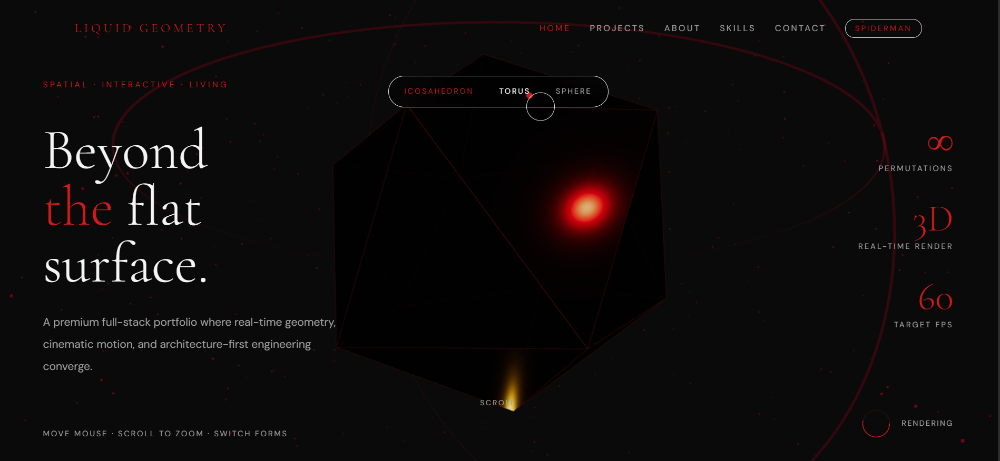
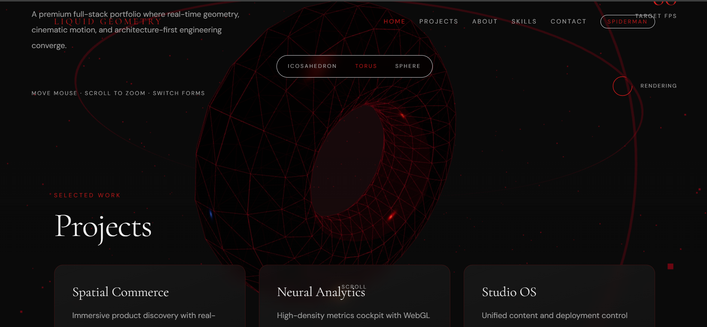
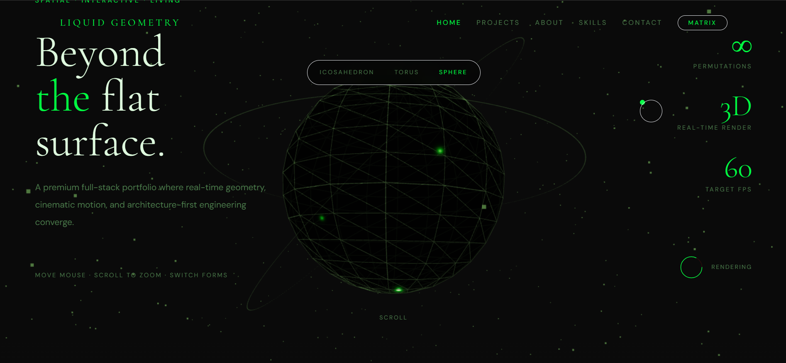
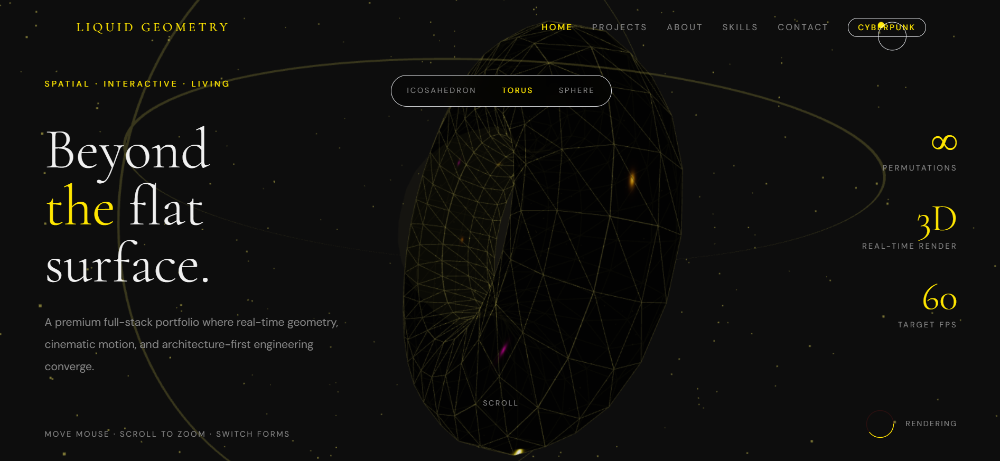

# 🌊 Liquid Geometry
### A Premium 3D Developer Portfolio Experience


---

<table>
  <tr>
    <td>
      
      <p align="center"><b>Spiderman Theme</b><br/>Icosahedron Geometry</p>
    </td>
    <td>
      
      <p align="center"><b>Cyberpunk Theme</b><br/>Torus Geometry</p>
    </td>
  </tr>
  <tr>
    <td>
      
      <p align="center"><b>Matrix Theme</b><br/>Sphere Geometry</p>
    </td>
    <td>
      
      <p align="center"><b>Portfolio Overview</b><br/>Project Section Display</p>
    </td>
  </tr>
</table>

---

## ✨ Features

- 🎮 **Real-time 3D Rendering**: Interactive Icosahedron, Torus, and Sphere geometries powered by Three.js.
- 🎨 **Multi-Theme System**: Seamlessly switch between **Naruto**, **Cyberpunk**, **Spiderman**, and **Matrix** aesthetics.
- 🖱️ **Mouse Parallax**: Dynamic camera and object movement based on cursor position.
- 🔍 **Scroll Interaction**: Fluid zoom and section transitions that respond to scroll progress.
- 🚀 **Performance Optimized**: Built for a smooth 60 FPS target with adaptive quality scaling.
- 📱 **Fully Responsive**: Optimized experience across all device types and screen sizes.

---

## 🛠️ Tech Stack

| Category | Technology |
| :--- | :--- |
| **Frontend** | Next.js 14 (App Router), React 18 |
| **3D Engine** | Three.js, React Three Fiber, R3F Drei |
| **Styling** | Tailwind CSS, CSS Variables |
| **Language** | TypeScript |
| **Animation** | Framer Motion, GSAP |
| **State Management** | Zustand |

---

## 🚀 Getting Started

To run this project locally, follow these steps:

```bash
# Clone the repository
git clone https://github.com/riteshthakur21/3D_website.git

# Navigate to the project directory
cd 3D_website

# Install dependencies
npm install

# Start the development server
npm run dev
```

Open [http://localhost:3000](http://localhost:3000) with your browser to see the result.

---

## 🎭 Theme Showcase

Explore the different visual identities crafted for this portfolio:

| Theme | Accent Color | Vibe |
| :--- | :--- | :--- |
| **Naruto** | Orange `#FF6B00` | Ninja Energy |
| **Cyberpunk** | Yellow `#FFE600` | Neon Future |
| **Spiderman** | Red `#CC0000` | Dark Hero |
| **Matrix** | Green `#00FF41` | Digital Rain |

---

## 📂 Project Structure

```text
src/
├── app/          # Next.js App Router (Layouts, Pages, APIs)
├── components/   # UI, Sections, and Three.js Scene components
├── data/         # Static content (Projects, Skills, Timeline)
├── hooks/        # Custom React hooks (3D, Animation, UI)
├── lib/          # Utilities, Constants, and Validation
├── store/        # Zustand state management (UI, Scene)
├── styles/       # Global CSS and Design Tokens
└── types/        # TypeScript Definitions
```

---

## 🔗 Contact & Links

- **Developer**: Ritesh Raj
- **GitHub**: [@riteshthakur21](https://github.com/riteshthakur21)
- **Live Demo**: [Liquid Geometry Live](http://localhost:3000) *(Local Preview)*

A premium developer portfolio pushing the boundaries of the web with real-time 3D geometry, cinematic motion, and architecture-first engineering.

---
